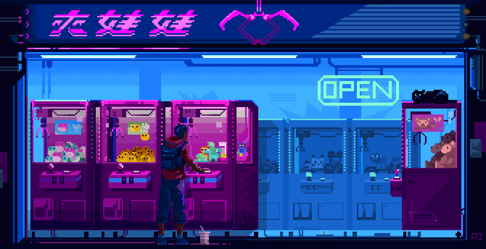

<h1 align="center">I'm Aykut Kayra Akkuş</h1>

  

---

### 🚀 About Me
- 🎓 4th-year Software Engineering student at Istinye University  
- 🎮 Building games with **Unity & C#** and mobile puzzle experiences with **Flutter**  
- 🧠 Interested in **RNG design**, **DDA (dynamic difficulty adjustment)**, and puzzle game systems  
- 🌍 Location: Besiktas, Istanbul
- 🌐 Portfolio: **https://www.aykuttakkus.com**

---

## 🛠️ Skills & Tools

### 🎮 Game Development

### 💻 Backend-Frontend

### 🧠 Computer Vision / AI

### 🗄️ Data & Tools

---

## 📌 Featured Projects
- 🎯 **Polygon Racer (Unity)** — Low-poly arcade racing game (Android / iOS / WebGL)  
  Repo: https://github.com/aykuttakkus/polygon-racer-unity

- 🏹 **Ball Launcher (Unity)** — Physics-based slingshot game (Android / iOS / WebGL)  
  Repo: https://github.com/aykuttakkus/ball-launcher-unity

- 🧠 **Hafızai (Flutter)** — Memory-based puzzle game on a 5×5 dice grid  
  Repo: https://github.com/aykuttakkus/hafizai_app

- 🥊 **UFC Website (Full-Stack)** — React + Node.js + MongoDB, custom scraping pipeline + REST API  
  Repo: https://github.com/aykuttakkus/ufc_website

---

## 🌐 Connect
- LinkedIn: (https://www.linkedin.com/in/aykuttakkus/)
- Website/Portfolio: (www.aykuttakkus.com)
- Mail: (aykutk.akkus@gmail.com)
